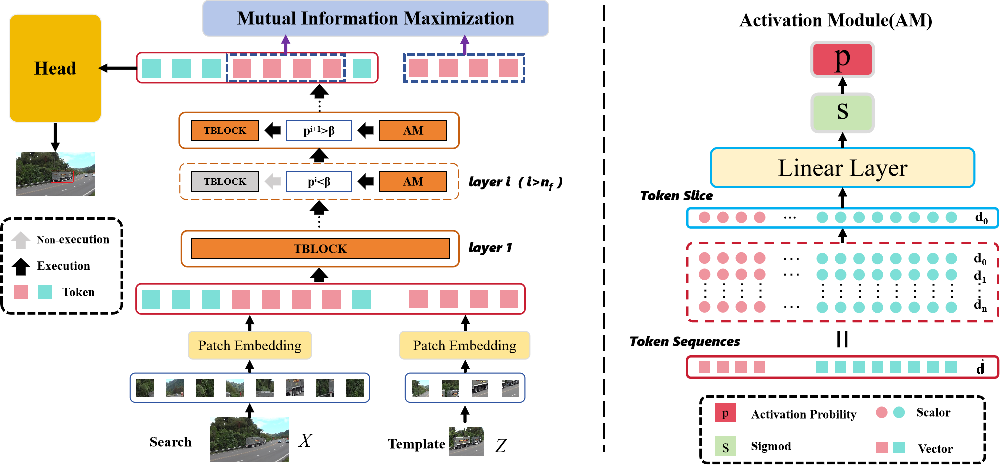
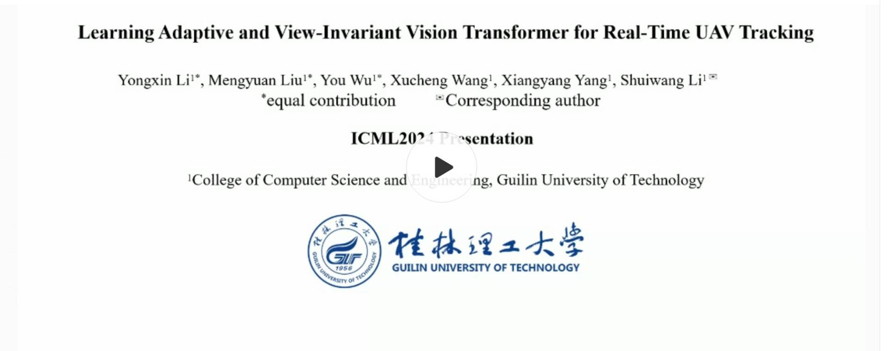

# AVTrack
The official implementation for the **ICML 2024** paper [ [**Learning Adaptive and View-Invariant Vision Transformer for Real-Time UAV Tracking**](https://openreview.net/pdf?id=eaNLvrP8n1)] and its **extendsion paper** [ [**Learning Adaptive and View-Invariant Vision Transformer with Multi-Teacher Knowledge Distillation for Real-Time UAV Tracking**](https://arxiv.org/pdf/2412.20002)]

[Models & Raw Results](https://pan.baidu.com/s/1sAGbZxIHfw0ahdpKVeqhIg?pwd=avtr) Baidu Driver: avtr [Models & Raw Results](https://drive.google.com/drive/folders/1dUi_7bSEpYgMQOPCvPZG7FKDyFz9oLh0?usp=sharing) Google Driver

##  Methodology

<p align="center">
  
</p>

## Usage
### Installation
Create and activate a conda environment:
```
conda create -n AVTrack python=3.8
conda activate AVTrack
```

Install the required packages:
```
pip install -r requirement.txt
```

## Data Preparation
Put the tracking datasets in ./data. It should look like:
   ```
   ${PROJECT_ROOT}
    -- data
        -- lasot
            |-- airplane
            |-- basketball
            |-- bear
            ...
        -- got10k
            |-- test
            |-- train
            |-- val
        -- coco
            |-- annotations
            |-- images
        -- trackingnet
            |-- TRAIN_0
            |-- TRAIN_1
            ...
            |-- TRAIN_11
            |-- TEST
        -- dtb70
            |-- Animal1
            |-- Animal2
            ...
            |-- Yacht4
            |-- Zebra     
         -- uavdt
            |-- anno
            |-- sequences
         -- visdrone2018
            |-- annotations
            |-- sequences   
         -- uav123
            |-- anno
            |-- data_seq
         -- uav123@10fps
            |-- anno
            |-- data_seq            
   ```

### Path Setting
Run the following command to set paths:
```
cd <PATH_of_AVTrack>
python tracking/create_default_local_file.py --workspace_dir . --data_dir ./data --save_dir ./output
```
You can also modify paths by these two files:
```
./lib/train/admin/local.py  # paths for training
./lib/test/evaluation/local.py  # paths for testing
```

### Training
Download pre-trained [DeiT-Tiny weights](https://dl.fbaipublicfiles.com/deit/deit_tiny_patch16_224-a1311bcf.pth), [Eva02-Tiny weights](https://huggingface.co/Yuxin-CV/EVA-02/resolve/main/eva02/pt/eva02_Ti_pt_in21k_p14.pt) , and [ViT-Tiny weights](https://storage.googleapis.com/vit_models/augreg/Ti_16-i21k-300ep-lr_0.001-aug_none-wd_0.03-do_0.0-sd_0.0--imagenet2012-steps_20k-lr_0.03-res_224.npz)  and put it under `$USER_ROOT$/.cache/torch/hub/checkpoints/. 
```
# Training AVTrack-DeiT
python tracking/train.py --script avtrack --config deit_tiny_patch16_224  --save_dir ./output --mode single

# Training AVTrack-MD-DeiT
# You need to download the AVTrack-DeiT, AVTrack-ViT, and AVTrack-Eva models and place them under the directory $PROJECT_ROOT$/teacher_model/.
python tracking/train.py --script avtrack --config deit_tiny_distilled_patch16_224  --save_dir ./output --mode single
```


### Testing
Download the model weights from [Google Drive](https://drive.google.com/drive/folders/1dUi_7bSEpYgMQOPCvPZG7FKDyFz9oLh0?usp=sharing) or [BaiduNetDisk](https://pan.baidu.com/s/1sAGbZxIHfw0ahdpKVeqhIg?pwd=avtr)

Put the downloaded weights on `<PATH_of_AVTrack>/output/checkpoints/train/avtrack/deit_tiny_patch16_224`

Change the corresponding values of `lib/test/evaluation/local.py` to the actual benchmark saving paths

 Testing examples:
- UAVDT
```
python tracking/test.py avtrack deit_tiny_patch16_224 --dataset uavdt --threads 4 --num_gpus 1
python tracking/analysis_results.py # need to modify tracker configs and names
```
- VisDrone2018
```
python tracking/test.py avtrack deit_tiny_distilled_patch16_224 --dataset visdrone2018 --threads 4 --num_gpus 1
python tracking/analysis_results.py # need to modify tracker configs and names
```
- DTB70 / UAV123 /UAV123@10fps .....

### Test FLOPs, and Params.

```
# Profiling AVTrack-DeiT
python tracking/profile_model.py --script avtrack --config deit_tiny_patch16_224

# Profiling AVTrack-MD-DeiT
python tracking/profile_model.py --script avtrack --config deit_tiny_distilled_patch16_224
```


## Acknowledgment
* This repo is based on [OSTrack](https://github.com/botaoye/OSTrack) and [PyTracking](https://github.com/visionml/pytracking) library which are excellent works and help us to quickly implement our ideas.

* We use the implementation of the DeiT, Eva02, and ViT from the [Timm](https://github.com/rwightman/pytorch-image-models) repo. 

## Presentation Demo

[](https://www.youtube.com/watch?v=N5nW1pWblZw)


## Citation
If our work is useful for your research, please consider citing:
```Bibtex
@inproceedings{lilearning,
  title={Learning Adaptive and View-Invariant Vision Transformer for Real-Time UAV Tracking},
  author={Li, Yongxin and Liu, Mengyuan and Wu, You and Wang, Xucheng and Yang, Xiangyang and Li, Shuiwang},
  booktitle={Forty-first International Conference on Machine Learning}
}
```

```Bibtex
@article{wu2024learning,
  title={Learning Adaptive and View-Invariant Vision Transformer with Multi-Teacher Knowledge Distillation for Real-Time UAV Tracking},
  author={Wu, You and Li, Yongxin and Liu, Mengyuan and Wang, Xucheng and Yang, Xiangyang and Ye, Hengzhou and Zeng, Dan and Zhao, Qijun and Li, Shuiwang},
  journal={arXiv preprint arXiv:2412.20002},
  year={2024}
}
```

